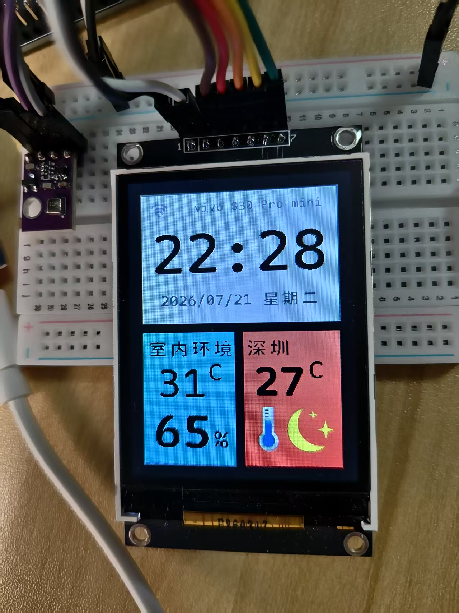
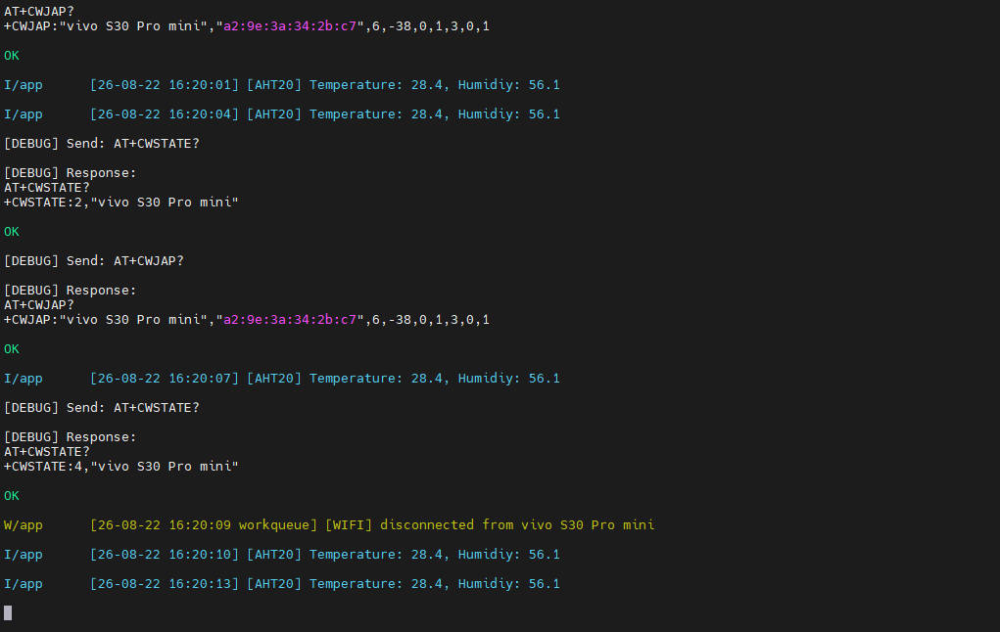
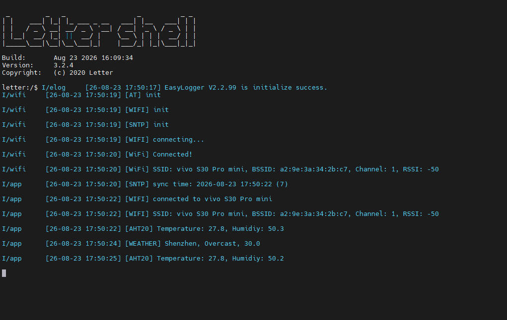

# 天气时钟

> 注意：仓库默认 `main` 分支为裸机项目，**FreeRTOS 版本在 `dev/freertos` 分支**；`feat/log` 分支在 `dev/freertos` 基础上增加了 EasyLogger 异步日志。

## 实现效果







这是一个 **STM32F4 + FreeRTOS + ESP AT 模组（ESP8266 / ESP32-C3）+ ST7789 彩屏** 的温湿度天气时钟项目。

## 硬件来源

F407ZGT6开发板：[STM32F407VET6 407ZGT6开发板 STM32学习板/ARM嵌入式开发板-淘宝网](https://item.taobao.com/item.htm?id=560814289385&mi_id=0000pAetoN1zqAF-d_WzO2nx09kIsoRhgYdrX3sQv9P9ys8&skuId=4346181285286&spm=tbpc.boughtlist.suborder_itemtitle.1.62b32e8dwBhgBf)

AHT30温湿度传感器模块：[AHT10/20/30温湿度传感器模块 高精度湿度传感器探头 I2C数字信号-淘宝网](https://item.taobao.com/item.htm?id=948969915117&mi_id=0000DoWz14Lt0jjFJ4EpnGqlQ2naiZ70OIzNYXe6OcXg-OE&skuId=6029708599451&spm=tbpc.boughtlist.suborder_itemtitle.1.62b32e8dwBhgBf)

ESP32C3开发板2.4GWIFI蓝牙模块：https://mobile.yangkeduo.com/goods2.html?ps=LVQqM9Zj5g

ST7789彩色屏幕：https://mobile.yangkeduo.com/goods.html?ps=hzo4eGfze3

## 开发环境

- IDE: keil MDK-ARM MDK542a
- 固件库：STM32F4xx_DSP_StdPeriph_Lib_V1.9.0
- 编译器：ARM Compiler
- 日志库：EasyLogger（异步输出模式）
- 辅助工具：VS Code + Codex GLM5.2  Gemini Pro
- ESP32C3固件：ESP32-C3-MINI-1-AT-V4.1.0.0  固件烧录工具flash_download_tool

## 快速开始

- 用 Keil 打开 `mdk/stm32f407.uvprojx`
- 确认芯片型号为 STM32F407ZGT6，STM32F407VET6 也可
- 编译
- 通过 ST-Link / J-Link 将程序下载到开发板

## 日志系统（EasyLogger 异步日志）

工程移植了 [Armink/EasyLogger](https://github.com/armink/EasyLogger)，并启用了**异步输出模式**：业务任务调用 `log_*` 时只负责把格式化后的日志写入异步缓冲，由独立的 `elog` 任务统一取出并通过串口输出，日志打印不会阻塞、拖累业务任务的实时性。

```
业务任务 log_i()/log_e()...
        │
        ▼
格式化日志 ──► 异步缓冲（1280B）
        │
        ▼ 信号量通知
   elog 任务（elog_port.c）
        │
        ▼
   console_write() ──► USART1（115200，DMA 发送）
```

### 代码位置

- 库源码：`third_lib/easylogger/`（`elog.c` / `elog_async.c` / `elog_buf.c`）
- FreeRTOS 移植：`third_lib/easylogger/port/elog_port.c`
  - 互斥锁保护串口输出；
  - 二值信号量唤醒异步输出任务；
  - 输出前自动填充时间戳（RTC 时间）和当前线程名。
- 配置：`third_lib/easylogger/inc/elog_cfg.h`
  - `ELOG_ASYNC_OUTPUT_ENABLE`：开启异步输出；
  - `ELOG_ASYNC_OUTPUT_BUF_SIZE`：异步缓冲 1280 字节；
  - `ELOG_ASYNC_OUTPUT_LVL`：ERROR 及以上级别走异步，ASSERT 同步输出；
  - `ELOG_COLOR_ENABLE`：不同级别带 ANSI 颜色。

### 使用方式

每个模块顶部声明自己的标签和输出级别，然后直接调用即可：

```c
#define LOG_TAG "app"
#define LOG_LVL  ELOG_LVL_INFO
#include "elog.h"

log_i("[SNTP] sync time: %04u-%02u-%02u %02u:%02u:%02u\n", ...);
log_e("[AT] Wifi info get failed\n");
```

启动时在 `app/main.c` 中完成初始化，并按级别配置输出格式（时间、线程、标签等）：

```c
elog_init();
elog_set_fmt(ELOG_LVL_ERROR, ELOG_FMT_ALL);
elog_set_fmt(ELOG_LVL_INFO,  ELOG_FMT_LVL | ELOG_FMT_TAG | ELOG_FMT_TIME);
elog_start();
```

## 项目整体分层架构

```
STM32F4_WeatherClock_FreeRTOS
│
├── firmware/                    ← 第0层：厂商代码（基本不改）
│   ├── cmsis/                   ← ARM Cortex-M4 内核支持
│   │   ├── core/                ← core_cm4.h, 指令集
│   │   └── device/              ← stm32f4xx.h, system_stm32f4xx.c, 中断向量表
│   └── driver/                  ← STM32 标准外设库（SPI, I2C, GPIO, RTC...）
│       ├── src/                 ← stm32f4xx_spi.c, stm32f4xx_i2c.c ...
│       └── inc/                 ← 对应的 .h
│
├── third_lib/                   ← 第1层：第三方中间件
│   ├── freertos/                ← FreeRTOS 内核源码（不改）
│   │   ├── tasks.c, queue.c, timers.c ...
│   │   └── portable/            ← FreeRTOSConfig.h, port.c（要改的在这里）
│   └── easylogger/              ← EasyLogger 日志库（异步输出，见下文）
│
├── driver/                      ← 第2层：外设驱动（自己写的）
│   ├── st7789/                  ← LCD 驱动（SPI1 + DMA + 信号量）
│   ├── rtc/                     ← RTC 封装（LSE 独立走时，读写校验）
│   ├── aht20/                   ← 温湿度传感器（I2C2）
│   ├── esp_at/                  ← ESP AT 指令封装（USART2，适配 ESP8266/ESP32-C3 AT 固件）
│   ├── console/                 ← 串口 printf 重定向（USART1 DMA 发送）
│   ├── key/                     ← 按键驱动
│   ├── led/                     ← LED 驱动
│   ├── bl24c512/                ← I2C EEPROM 驱动
│   ├── tim_delay/               ← 微秒延时（裸机用）
│   └── cpu_tick/                ← CPU 滴答
│
├── app/                         ← 第3层：应用层
│   ├── board.c                  ← 板级初始化（时钟、外设时钟使能、VTOR 重定位）
│   ├── main.c                   ← 入口 + 启动流程编排
│   ├── app.h / ui.h / workqueue.h ← 应用层接口头文件
│   ├── workqueue.c              ← 通用工作队列（基础设施）
│   ├── ui.c                     ← UI 渲染队列（基础设施）
│   ├── weather.c                ← 天气 JSON 解析（纯算法，无硬件依赖）
│   ├── wifi.c                   ← WiFi 初始化 + 等待连接
│   ├── app.c                    ← 业务编排（定时器 + 工作调度）
│   ├── page/                    ← 页面模块
│   │   ├── page.h               ← 页面接口声明
│   │   ├── welcome_page.c       ← 欢迎页
│   │   ├── wifi_page.c          ← WiFi 连接页
│   │   ├── main_page.c          ← 主页面（时钟+温湿度+天气）
│   │   └── error_page.c         ← 错误页
│   ├── font/                    ← 字库数据（ASCII + 中文点阵）
│   └── image/                   ← 图片数据（天气图标、WiFi图标等）
│
├── scripts/                     ← 构建/发布脚本
│   └── gen_magic_header.py      ← 生成带 MAGI 头的 xbin 升级固件
├── tools/                       ← 辅助工具（字库转换、HTTP/SSID 调试等）
├── mdk/                         ← Keil 工程（stm32f407.uvprojx）
└── generated/                   ← 生成的 xbin（已被 .gitignore 忽略）
```

### 依赖方向：严格单向

        app.c（业务编排）
       /    |    \
      ▼     ▼     ▼
     page/*  wifi  weather     ← 纯逻辑层，只依赖 ui.h / driver
      │
      ▼
    ui.c  workqueue.c         ← 基础设施层
      │
      ▼
    driver/st7789  driver/rtc  driver/aht20  driver/esp_at  ← 硬件抽象层
      │
      ▼
    firmware/stm32f4xx_*       ← 标准外设库
      │
      ▼
    CMSIS / 寄存器              ← 硬件

### 定时器配置

```c
time_update_timer = xTimerCreate("time update",
    pdMS_TO_TICKS(1000),   // ← 每 1 秒触发，永远不停
    pdTRUE,                 // ← 自动重载
    time_update,            // ← 存为 Timer ID（函数指针）
    app_timer_cb);          // ← 回调：直接执行，不走 workqueue
```

`time_update_timer` 是 `pdTRUE`（周期性定时器），创建后立刻启动，永远 1 秒一次。它和 WiFi 状态没有任何耦合。

工程共 5 个定时器，负责不同的刷新节奏：

| 定时器 | 周期 | 职责 | 执行方式 |
| --- | --- | --- | --- |
| `time_update` | 1s | 读 RTC，脏检测后刷新时间/日期 | 定时器回调直接执行 |
| `time_sync` | 首次 200ms，成功后 1h，失败 1s 重试 | SNTP 网络对时并写入 RTC | 投递到 workqueue |
| `wifi_update` | 5s | 轮询 WiFi 状态，变化时刷新 SSID | 投递到 workqueue |
| `inner_update` | 3s | AHT20 测量室内温湿度 | 投递到 workqueue |
| `outdoor_update` | 1min | HTTP 拉取天气并解析刷新 | 投递到 workqueue |

#### RTC时间校准

```
时间线 ──────────────────────────────────────────────────────►

[设备开机]          [WiFi连接成功]       [WiFi意外断开]        [WiFi重新连上]
    │                    │                      │                      │
    │     time_sync()    │                      │     time_sync()      │
    │     SNTP网络对时   │                      │     网络对时失败     │
    │     同步写入RTC硬件│                      │     间隔1s自动重试  │
    │                     │                      │     RTC硬件计时不受断网影响 │
    │                     │                      │                      │
    └───────────── time_update() 循环任务 ──────────────────────────────┘
             每秒读取RTC硬件时间，刷新屏幕时钟UI
             时间流转示例：23:59:58 → 23:59:59 → 00:00:00 → 00:00:01 …

核心特性：RTC硬件独立计时，设备上电/断网全程持续走时，不会中断
```

**RTC 只要被成功写入过一次正确时间，之后就算 WiFi 永久断开，它也会靠 LSE 晶振持续走时。** 精度由晶振决定——±20ppm 的 LSE 日误差约 1.7 秒，完全够用。断开 WiFi 唯一的影响是**无法自动校准累积误差**，但走时本身不会停。

### UI分层渲染架构

```
┌──────────────────────────────────────────────────────────────┐
│  Layer 4: app.c 业务逻辑层                                    │
│  ┌──────────────────────────────────────────────────────────┐│
│  │ 只管"什么时候更新什么数据"，完全不关心UI怎么画的           ││
│  │ main_page_redraw_time(&date)                             ││
│  │ main_page_redraw_inner_temperature(25.3f)                ││
│  └──────────────────────┬───────────────────────────────────┘│
├─────────────────────────┼────────────────────────────────────┤
│  Layer 3: page/*.c 页面组合层                                 │
│  ┌──────────────────────┴───────────────────────────────────┐│
│  │ 只管"这一页长什么样"，坐标、颜色、字体                    ││
│  │ ui_write_string(25, 42, str, BLACK, bg, &font76);        ││
│  │ ui_fill_color(15, 15, 224, 154, color_bg_time);          ││
│  └──────────────────────┬───────────────────────────────────┘│
├─────────────────────────┼────────────────────────────────────┤
│  Layer 2: ui.c 渲染抽象层    ← ★ 解耦的关键！                │
│  ┌──────────────────────┴───────────────────────────────────┐│
│  │ 只定义三种操作，全部通过队列异步执行                       ││
│  │ FILL_COLOR / WRITE_STRING / DRAW_IMAGE                   ││
│  │                                                          ││
│  │  page层调用 ui_write_string() ──入队──► ui任务取出执行    ││
│  └──────────────────────┬───────────────────────────────────┘│
├─────────────────────────┼────────────────────────────────────┤
│  Layer 1: st7789.c 硬件驱动层                                 │
│  ┌──────────────────────┴───────────────────────────────────┐│
│  │ 只管 SPI/DMA/GPIO 操作，像素怎么发送到屏幕                ││
│  │ st7789_write_gram(...)  ← DMA + 信号量等待完成            ││
│  └──────────────────────────────────────────────────────────┘│
└──────────────────────────────────────────────────────────────┘
```

关键解耦机制：`ui_queue`

```
  以前（紧密耦合）：              现在（队列解耦）：

main_page_redraw_time()        main_page_redraw_time()
  │                                │
  └─► st7789_write_string()       └─► ui_write_string()
        │                                │
        └─► SPI发送                    └─► xQueueSend(ui_queue) ← 投递完立刻返回
               │                              │
               │                         ui_func() 任务
               │                              │
               └─ 调用者阻塞等待              └─► st7789_write_string()
                                                    │
                                                    └─► SPI/DMA 发送
```

完整数据流向图

```
[NTP 服务器]                [心知天气 API]
       │                            │
       ▼                            ▼
  esp_at_sntp_get_time()    esp_at_http_get()
       │                            │
       ▼                            ▼
  rtc_set_time()              parse_seniverse_response()
       │                            │
       ▼                            ▼
  [STM32 硬件 RTC]            outdoor_update()
       │                            │
       ▼                            │
  time_update() ── 每秒 ──► memcmp脏检测 ──► main_page_redraw_*()
       │                                      │
       │                                      ▼
       │                              ui_write_string()
       │                              ui_draw_image()
       │                              ui_fill_color()
       │                                      │
       │                              [ui_queue 消息队列]
       │                                      │
       │                                      ▼
       │                              ui_func() 任务
       │                                      │
       │                                      ▼
       │                              st7789_write_string()
       │                              st7789_draw_image()
       │                              st7789_fill_color()
       │                                      │
       │                              [SPI1 DMA + 信号量]
       │                                      │
       ▼                                      ▼
  [屏幕显示 时钟/日期/温湿度/天气]
```

## 固件发布：xbin 生成（配合 Bootloader）

本工程位于 Bootloader 工作区中，主程序需要运行在 Bootloader 之后的地址。`app/board.c` 里通过

```c
SCB->VTOR = 0x08010000;
```

完成中断向量表重定位，主程序从 `0x08010000` 开始运行。

`scripts/gen_magic_header.py` 负责把 Keil 编译出的 bin 打包成带 4KB **MAGI magic header** 的升级固件，Bootloader 可以据此校验固件完整性并跳转：

```powershell
python scripts\gen_magic_header.py mdk\Objects\stm32f407.bin
```

运行后生成 `generated/stm32f407_upgrade.xbin`（4KB 头部 + 原始 bin，该目录已被 `.gitignore` 忽略）。

头部主要字段：

| 字段 | 说明 |
| --- | --- |
| magic | `MAGI`（0x4D414749），固件包标识 |
| data_type | 数据类型，1 = 固件 |
| data_offset | 固件数据偏移，4096（4KB 头部之后） |
| data_address | 固件运行地址 `0x08010000` |
| data_length / data_crc32 | 固件长度与 CRC32 校验 |
| version | 版本号，如 `v1.0.0-260822-1030-alpha` |
| this_address / this_crc32 | 头部自身地址与 CRC32 校验 |

每次发版流程：Keil 编译出 `mdk/Objects/stm32f407.bin` → 运行上述脚本生成 xbin → 将 xbin 交给 Bootloader 升级。
